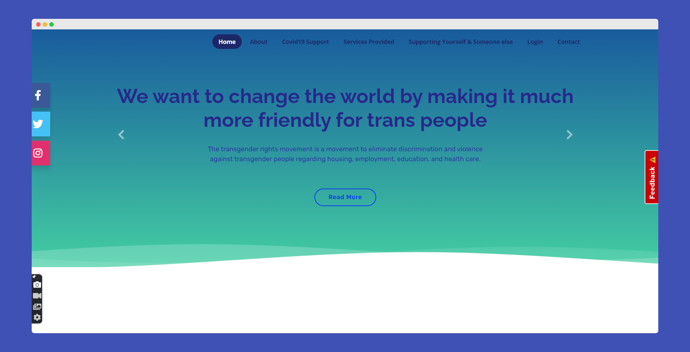

<h2 align="center">Transopedia </h2>

Transopedia is a website created to make difference in society as well as in the lifes of transgender community by providing different online and offline support including fund support.

<h4>[ In development Phase ] 

<h2> 
📌<a href="https://shrutimishra-2002.github.io/Transopedia-website/" target="_blank">Visit our website 🚀</a>


## 📌 Sneak Peak of main website
 
<!-- <h2>THE MAIN PAGE</h2> -->

<br><br><br>


<!-- <h2>ABOUT US PAGE </h2>

<br><br><br>


<h2>GALLERY PAGE</h2>

<br><br><br>


<h2>GOVERNMENT HELP DESK </h2>

<br><br><br>


<h2>LOGIN PAGE</h2>

<br><br><br>


<h2>CONTACT PAGE</h2>

<br><br><br> -->


# Contribution is fun! 🧡

## 📌 Tech Stack


In order to make a hassle-free environment, I implore you all (_while contributing_) to follow the instructions mentioned below!

Happy Submissions :slightly_smiling_face:

<h2 align=center> Project Maintainer ⚡ </h2>
<p align="center">
  <a href="https://github.com/ShrutiMishra-2002"></a> 
	<p align="center">


<h2 align=center> OUR VALUABLE CONTRIBUTORS✨ </h2>
<p align="center">
  
	
<a href="https://github.com/SauravMukherjee44/Aec-Library-Website/graphs/contributors">
  
</a>

<h2 align=center>Happy Coding 👨‍💻 </h2>

---

<h2>📬 Contact</h2>

If you want to contact me, you can reach me through below handles.
<div align="center">


<a  href="https://www.linkedin.com/in/shruti-mishra-b270a7203/" target="_blank"></a><span>
<a href="mailto:shrutidmishra2002@gmail.com"></span>

   
</div>
	
# Contributing Guidelines

This documentation contains a set of guidelines to help you during the contribution process. 
We are happy to welcome all the contributions from anyone willing to improve/add new scripts to any project. Thank you for helping out and remember,
**no contribution is too small.**

# Submitting Contributions👩‍💻👨‍💻
Below you will find the process and workflow used to review and merge your changes.

## Step 1 : Find an issue
- Take a look at the Existing Issues or create your **own** Issues!
- Wait for the Issue to be assigned to you after which you can start working on it.
- Note : can self-assing using '/assign' in comment section of that repo.


## Step 2 : Fork the Project
- Fork this Repository. This will create a Local Copy of this Repository on your Github Profile. Keep a reference to the original project in `upstream` remote.
```
$ git clone https://github.com/<your-username>/Reeponame
$ cd Reeponame
$ git remote add upstream https://github.com/ownwerusername/Reeponame
```

- If you have already forked the project, update your copy before working.
```
$ git remote update
$ git checkout <branch-name>
$ git rebase upstream/<branch-name>
```
## Step 3 : Branch
Create a new branch. Use its name to identify the issue your addressing.
```
# It will create a new branch with name Branch_Name and switch to that branch 
$ git checkout -b branch_name
```
## Step 4 : Work on the issue assigned
- Work on the issue(s) assigned to you. 
- Add all the files/folders needed.
- After you've made changes or made your contribution to the project add changes to the branch you've just created by:
```
# To add all new files to branch Branch_Name
$ git add .
```
## Step 5 : Commit

 🎀🎀Before submitting an issue please find the correct folder where your program will go , You can discuss about it in the discussion.
 
- To commit give a descriptive message for the convenience of reveiwer by:
```
# This message get associated with all files you have changed
$ git commit -m "message"
```
- **NOTE**: A PR should have only one commit. Multiple commits should be squashed.
## Step 6 : Work Remotely
- Now you are ready to your work to the remote repository.
- When your work is ready and complies with the project conventions, upload your changes to your fork:

```
# To push your work to your remote repository
$ git push -u origin Branch_Name
```

## Step 7 : Pull Request
- Go to your repository in browser and click on compare and pull requests. Then add a title and description to your pull request that explains your contribution.

- Voila! Your Pull Request has been submitted and will be reviewed by the moderators and merged.🥳
Congratulations! You've already made your first contribution.🥳

Good Luck for your journey

<!-- https://shrutimishra-2002.github.io/The-Mandarin-Oriental/ -->
<br><br>

<div align="center">
© 2021 Shruti Mishra </div>
<!-- CONTENT OF PROJECT -->


